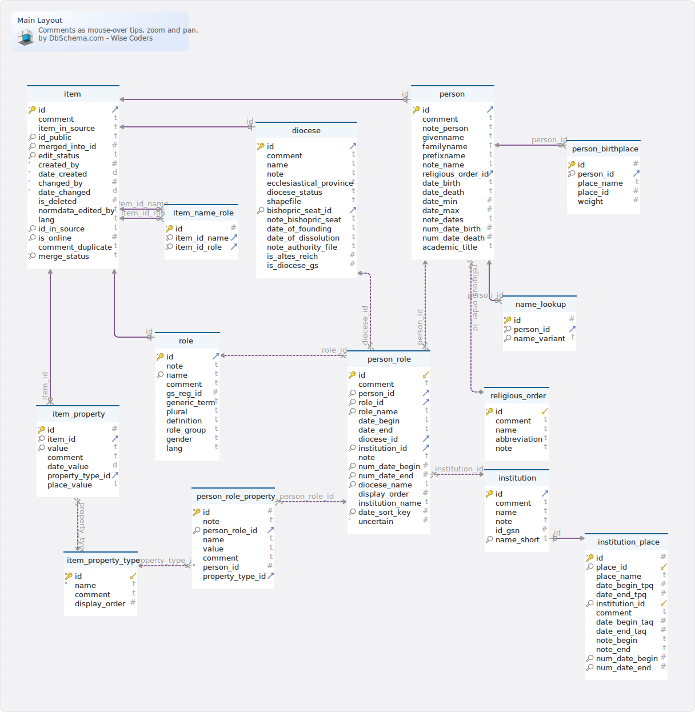
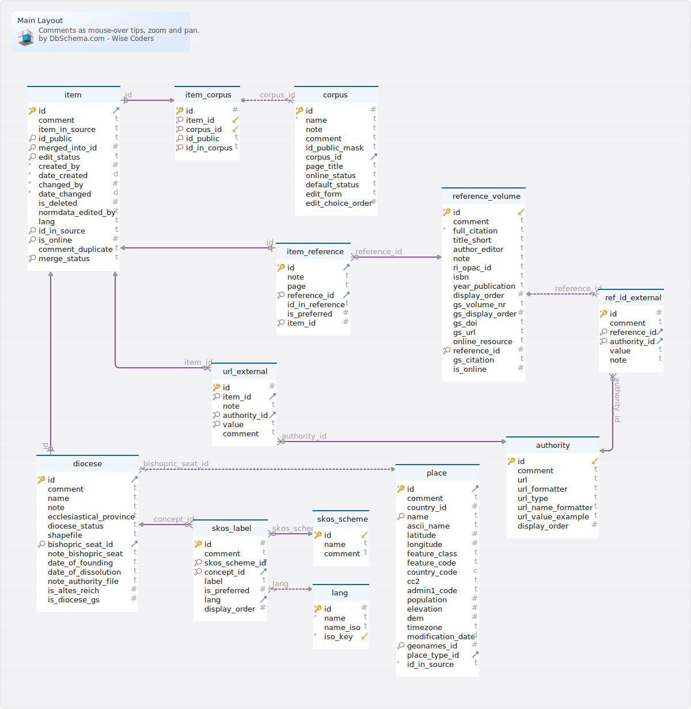
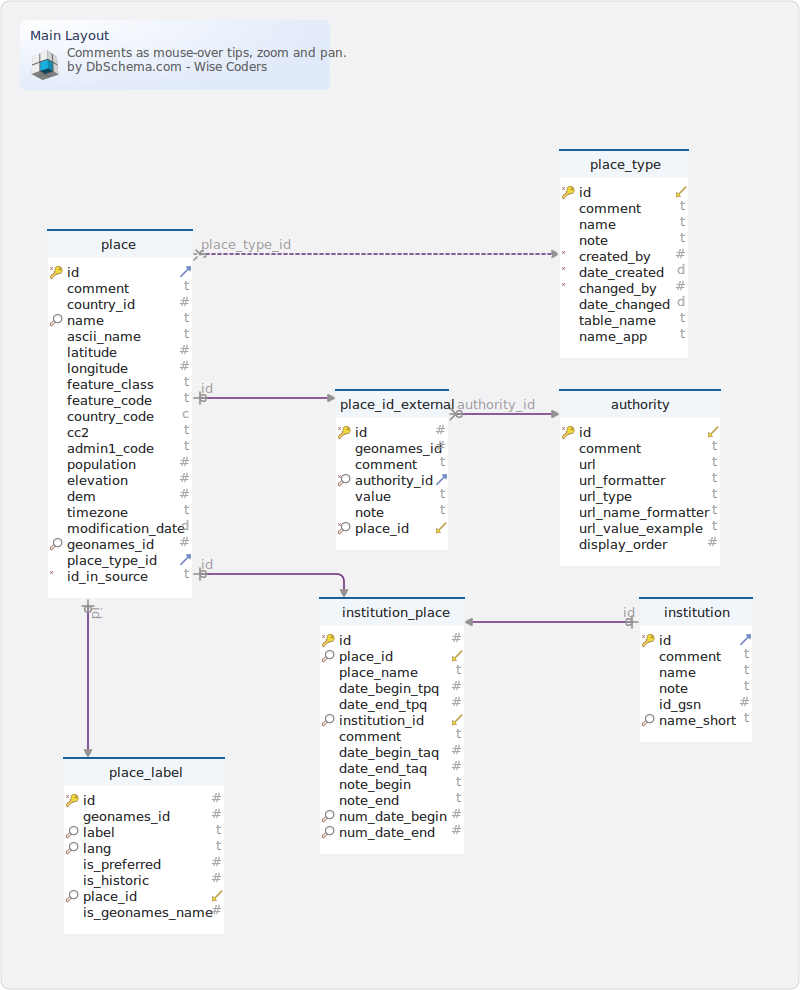

Generated using [DbSchema](https://dbschema.com)

### Item data

### Table wiag3.diocese 
diocese

|Idx |Name |Data Type |Description |
|---|---|---|---|
| * &#128273;  &#11016; | id| INT AUTO_INCREMENT | internal and foreign key item.id |
|  | comment| VARCHAR(1023)  | editorial note |
|  | name| VARCHAR(255)  | name, e.g. 'Bamberg' |
|  | note| VARCHAR(1023)  | additional information (visible to the user) |
|  | ecclesiastical\_province| VARCHAR(255)  | Kirchenprovinz |
|  | diocese\_status| VARCHAR(31)  | e.g.: "Bistum", "Erzbistum" |
|  | shapefile| VARCHAR(31)  | not in use |
| &#128270; &#11016; | bishopric\_seat\_id| INT  | foreign key to place.id for the bishopric seat |
|  | note\_bishopric\_seat| VARCHAR(1023)  | note about the bishopric seat |
|  | date\_of\_founding| VARCHAR(63)  | date of founding |
|  | date\_of\_dissolution| VARCHAR(63)  | date of dissolution (Aufhebung) |
|  | note\_authority\_file| VARCHAR(255)  | note about external IDs |
|  | is\_altes\_reich| TINYINT  | 1 if diocese belongs to Altes Reich |
|  | is\_diocese\_gs| TINYINT  | 1 if diocese is of special interest for Germania Sacra |

### Table wiag3.institution 
institution related to an office
Domstifte and monasteries

|Idx |Name |Data Type |Description |
|---|---|---|---|
| * &#128273;  &#11016; | id| INT AUTO_INCREMENT |  |
|  | comment| VARCHAR(255)  | editorial note |
|  | name| VARCHAR(255)  | name |
|  | note| VARCHAR(2047)  | additional information |
|  | id\_gsn| INT  | GSN ID (Klosterdatenbank) |
| &#128270; | name\_short| VARCHAR(100)  | short version of the name, e.g. "Magdeburg" for "Domstift Magdeburg" |

### Table wiag3.institution_place 
link institution with a place, geographic location

|Idx |Name |Data Type |Description |
|---|---|---|---|
| * &#128273;  | id| INT AUTO_INCREMENT |  |
| &#128270; &#11019; | place\_id| INT  | foreign key place.id |
|  | place\_name| VARCHAR(127)  | fall back for place.name |
|  | date\_begin\_tpq| INT  | foundation date, terminus post quem |
|  | date\_end\_tpq| INT  | date of abolition, terminus post quem |
| &#128270; &#11019; | institution\_id| INT  | foreign key institution.id |
|  | comment| VARCHAR(255)  | editorial note |
|  | date\_begin\_taq| INT  | foundation date, terminus ante quem |
|  | date\_end\_taq| INT  | date of abolition, terminus ante quem |
|  | note\_begin| VARCHAR(255)  | additional information on the foundation |
|  | note\_end| VARCHAR(600)  | additional information on the abolition |
| &#128270; | num\_date\_begin| INT  | evaluate date\_begin\_taq and date\_begin\_tpq to estimate num\_date\_begin |
| &#128270; | num\_date\_end| INT  | evaluate date\_end\_taq and date\_end\_tpq to estimate num\_date\_end |

### Table wiag3.item 
editorial meta data

|Idx |Name |Data Type |Description |
|---|---|---|---|
| * &#128273;  &#11016; | id| INT AUTO_INCREMENT |  |
|  | comment| VARCHAR(511)  | editorial notes |
|  | item\_in\_source| VARCHAR(2047)  | data as found in a text source |
| &#128270; | id\_public| VARCHAR(63)  | public id, "Normdatum" |
| &#128270; | merged\_into\_id| INT  | reference to item that contains this item |
| &#128270; | edit\_status| VARCHAR(31)  | edit status/publication status |
| * | created\_by| INT  | editor by id |
| * | date\_created| DATETIME  | creation date |
| * | changed\_by| INT  | editor by id |
| * | date\_changed| DATETIME  | date of last modification |
|  | is\_deleted| TINYINT  DEFAULT '0' | flag for deleted items |
|  | normdata\_edited\_by| VARCHAR(63)  | reference to user/editor |
|  | lang| VARCHAR(31)  DEFAULT 'de' | language code for this item |
| &#128270; | id\_in\_source| VARCHAR(63)  | technical ID in data source; unique relative to item\_type\_id |
| &#128270; | is\_online| TINYINT  DEFAULT '0' | 1 if item is online |
|  | comment\_duplicate| VARCHAR(255)  | editorial note about possible duplicates |
| * &#128270; | merge\_status| VARCHAR(31)  DEFAULT 'original' | one of: 'child' (default), 'child' (merged from other data records), 'parent' (merged into another data record, not accessible), 'orphan', (merged and split up again, not accessible) |

### Table wiag3.item_name_role 
map item to corresponding items in any corpus (technical table)

|Idx |Name |Data Type |Description |
|---|---|---|---|
| * &#128273;  | id| INT AUTO_INCREMENT |  |
| * &#128270; &#11016; | item\_id\_name| INT  | foreign key item.id, used to display name, birth date ... |
| * &#128270; &#11016; | item\_id\_role| INT  | foreign key item.id, used to display office data |

### Table wiag3.item_property 
additional property
supplement to the fields in person

|Idx |Name |Data Type |Description |
|---|---|---|---|
| * &#128273;  | id| INT AUTO_INCREMENT |  |
| * &#128270; &#11016; | item\_id| INT  | foreign key item.id |
| &#128270; | value| VARCHAR(511)  | property value |
|  | comment| VARCHAR(255)  | editorial note |
|  | date\_value| DATE  | date related to this property, e.g. ordination |
| &#11016; | property\_type\_id| INT  | foreign key item\_property\_type.id |
|  | place\_value| VARCHAR(63)  | place related to this property, e.g. ordination |

### Table wiag3.item_property_type 
type of item properties

|Idx |Name |Data Type |Description |
|---|---|---|---|
| * &#128273;  &#11019; | id| INT AUTO_INCREMENT |  |
| * | name| VARCHAR(63)  | type/name |
|  | comment| VARCHAR(255)  | editorial notes |
|  | display\_order| INT  | sort order, e.g. in a person's detail view |

### Table wiag3.name_lookup 
lookup name variants efficiently (technical table)

|Idx |Name |Data Type |Description |
|---|---|---|---|
| * &#128273;  | id| INT AUTO_INCREMENT |  |
| * &#128270; &#11016; | person\_id| INT  | foreign key person.id |
| &#128270; | name\_variant| VARCHAR(255)  | combination of given name variant and family name variant |

### Table wiag3.person 
human person

|Idx |Name |Data Type |Description |
|---|---|---|---|
| * &#128273;  &#11016; | id| INT AUTO_INCREMENT | id, equals item.id |
|  | comment| VARCHAR(2047)  | editorial note |
|  | note\_person| VARCHAR(1023)  | remarks about the person (visible) |
|  | givenname| VARCHAR(127)  | given name, christian name |
|  | familyname| VARCHAR(127)  | family name |
|  | prefixname| VARCHAR(63)  | name prefix, e.g. for noble families 'zu', 'von' |
|  | note\_name| VARCHAR(255)  | notes on name details |
| &#11016; | religious\_order\_id| INT  | foreign key religious\_order.id |
|  | date\_birth| VARCHAR(63)  | date of birth as text |
|  | date\_death| VARCHAR(63)  | date of death as text |
|  | date\_min| INT  | earliest date in office lists or date of birth |
|  | date\_max| INT  | latest date in office lists or date of death |
|  | note\_dates| VARCHAR(255)  | notes on date details |
|  | num\_date\_birth| INT  | year of birth |
|  | num\_date\_death| INT  | year of death |
|  | academic\_title| VARCHAR(63)  | academic title |

### Table wiag3.person_birthplace 
a person's birthplace

|Idx |Name |Data Type |Description |
|---|---|---|---|
| * &#128273;  | id| INT AUTO_INCREMENT |  |
| * &#128270; &#11016; | person\_id| INT  | foreign key person.id |
|  | place\_name| VARCHAR(63)  | place name in data source |
|  | place\_id| INT  | foreign key place.id |
|  | weight| DECIMAL(10,8)  | statistical value (see corpus of Priests of Utrecht) |

### Table wiag3.person_role 
a person's term of office

|Idx |Name |Data Type |Description |
|---|---|---|---|
| * &#128273;  &#11019; | id| INT AUTO_INCREMENT |  |
|  | comment| VARCHAR(255)  | editorial note |
| &#128270; &#11016; | person\_id| INT  | foreign key person.id |
| &#128270; &#11016; | role\_id| INT  | foreign key role.id |
| &#128270; | role\_name| VARCHAR(127)  | fall back for role.name (see role.id) |
|  | date\_begin| VARCHAR(63)  | start date of the term of office (text) |
|  | date\_end| VARCHAR(63)  | end date of the term of office (text) |
| &#11016; | diocese\_id| INT  | foreign key diocese.id |
| &#128270; &#11016; | institution\_id| INT  | foreign key institution.id |
|  | note| VARCHAR(1023)  | additional information |
| &#128270; | num\_date\_begin| INT  | start date of the term of office (year, number) |
| &#128270; | num\_date\_end| INT  | end date of the term of office (year, number) |
| &#128270; | diocese\_name| VARCHAR(63)  | fall back for diocese.name (see diocese.id) |
|  | display\_order| INT  | sort order; see date\_sort\_key |
|  | institution\_name| VARCHAR(127)  | fall back for institution.name (see institution.id) |
| &#128270; | date\_sort\_key| INT  | the key is composed of a a year and a three digit key\e.g.: 834150, 1718230 |
| * | uncertain| TINYINT  DEFAULT '0' | 1 if office information is uncertain |

### Table wiag3.person_role_property 
additional property for person\_role,
e.g. Dignität, Archidiakonat

|Idx |Name |Data Type |Description |
|---|---|---|---|
| * &#128273;  | id| INT AUTO_INCREMENT |  |
|  | note| VARCHAR(255)  | additional information |
| &#128270; &#11016; | person\_role\_id| INT  | foreign key person\_role.id |
|  | name| VARCHAR(63)  | name |
|  | value| VARCHAR(511)  | property value |
|  | comment| VARCHAR(255)  | editorial note |
| * | person\_id| INT  | foreign key person.id (redundant because of person\_role\_id) |
| &#11016; | property\_type\_id| INT  | foreign key property\_type.id |

### Table wiag3.religious_order 
religious order

|Idx |Name |Data Type |Description |
|---|---|---|---|
| * &#128273;  &#11019; | id| INT  |  |
|  | comment| VARCHAR(255)  | editorial note |
|  | name| VARCHAR(127)  | name |
|  | abbreviation| VARCHAR(31)  | abbreviation, e.g. OSB |
|  | note| VARCHAR(255)  | additional information |

### Table wiag3.role 
office title

|Idx |Name |Data Type |Description |
|---|---|---|---|
| * &#128273;  &#11016; | id| INT  |  |
|  | note| VARCHAR(1023)  | additional information |
| &#128270; | name| VARCHAR(63)  | name |
|  | comment| VARCHAR(255)  | editorial note |
|  | gs\_reg\_id| INT  | ID in the registry of the Germania Sacra |
|  | generic\_term| VARCHAR(63)  | generic term for groups of offices |
|  | plural| VARCHAR(63)  | plural term |
|  | definition| VARCHAR(1023)  | definition |
|  | role\_group| VARCHAR(63)  | classification |
|  | gender| VARCHAR(31)  | m/f |
|  | lang| VARCHAR(31)  | 2-character code according to ISO 639-1 (not in use) |

### Meta

### Table wiag3.authority 
standardising institution

|Idx |Name |Data Type |Description |
|---|---|---|---|
| * &#128273;  &#11019; | id| INT AUTO_INCREMENT |  |
|  | comment| VARCHAR(255)  | editorial note |
|  | url| VARCHAR(127)  | institution home page |
|  | url\_formatter| VARCHAR(127)  | concatenate url\_formatter and id\_external.value to build a valid URL |
|  | url\_type| VARCHAR(63)  | type/class of the authority, e.g. 'Normdaten', 'Onlinearchivalien' |
|  | url\_name\_formatter| VARCHAR(127)  | concatenate the url\_name\_formatter and id\_external.value to display the url |
|  | url\_value\_example| VARCHAR(127)  | example for a valid URL |
|  | display\_order| INT  | sort order, e.g. for external IDs of a person |

### Table wiag3.corpus 
collection of data sources

|Idx |Name |Data Type |Description |
|---|---|---|---|
| * &#128273;  | id| INT  |  |
| * | name| VARCHAR(63)  | name/label |
|  | note| VARCHAR(511)  | explanatory note |
|  | comment| VARCHAR(511)  | editorial note |
|  | id\_public\_mask| VARCHAR(63)  | mask of the public ID (if applicable); use # as a placeholder for a digit |
| &#11016; | corpus\_id| VARCHAR(31)  | ID used for relations |
|  | page\_title| VARCHAR(255)  | page title, if the corpus corresponds to a queryable topic in the application |
|  | online\_status| VARCHAR(63)  | elements of the corpus are online if they have this status value |
|  | default\_status| VARCHAR(63)  | default status, if a new element is created |
|  | edit\_form| VARCHAR(31)  | name or type of the edit form within the application (technical) |
|  | edit\_choice\_order| INT  | sort order in the edit form in the application (technical) |

### Table wiag3.diocese 
diocese

|Idx |Name |Data Type |Description |
|---|---|---|---|
| * &#128273;  &#11016; | id| INT AUTO_INCREMENT | internal and foreign key item.id |
|  | comment| VARCHAR(1023)  | editorial note |
|  | name| VARCHAR(255)  | name, e.g. 'Bamberg' |
|  | note| VARCHAR(1023)  | additional information (visible to the user) |
|  | ecclesiastical\_province| VARCHAR(255)  | Kirchenprovinz |
|  | diocese\_status| VARCHAR(31)  | e.g.: "Bistum", "Erzbistum" |
|  | shapefile| VARCHAR(31)  | not in use |
| &#128270; &#11016; | bishopric\_seat\_id| INT  | foreign key to place.id for the bishopric seat |
|  | note\_bishopric\_seat| VARCHAR(1023)  | note about the bishopric seat |
|  | date\_of\_founding| VARCHAR(63)  | date of founding |
|  | date\_of\_dissolution| VARCHAR(63)  | date of dissolution (Aufhebung) |
|  | note\_authority\_file| VARCHAR(255)  | note about external IDs |
|  | is\_altes\_reich| TINYINT  | 1 if diocese belongs to Altes Reich |
|  | is\_diocese\_gs| TINYINT  | 1 if diocese is of special interest for Germania Sacra |

### Table wiag3.item 
editorial meta data

|Idx |Name |Data Type |Description |
|---|---|---|---|
| * &#128273;  &#11016; | id| INT AUTO_INCREMENT |  |
|  | comment| VARCHAR(511)  | editorial notes |
|  | item\_in\_source| VARCHAR(2047)  | data as found in a text source |
| &#128270; | id\_public| VARCHAR(63)  | public id, "Normdatum" |
| &#128270; | merged\_into\_id| INT  | reference to item that contains this item |
| &#128270; | edit\_status| VARCHAR(31)  | edit status/publication status |
| * | created\_by| INT  | editor by id |
| * | date\_created| DATETIME  | creation date |
| * | changed\_by| INT  | editor by id |
| * | date\_changed| DATETIME  | date of last modification |
|  | is\_deleted| TINYINT  DEFAULT '0' | flag for deleted items |
|  | normdata\_edited\_by| VARCHAR(63)  | reference to user/editor |
|  | lang| VARCHAR(31)  DEFAULT 'de' | language code for this item |
| &#128270; | id\_in\_source| VARCHAR(63)  | technical ID in data source; unique relative to item\_type\_id |
| &#128270; | is\_online| TINYINT  DEFAULT '0' | 1 if item is online |
|  | comment\_duplicate| VARCHAR(255)  | editorial note about possible duplicates |
| * &#128270; | merge\_status| VARCHAR(31)  DEFAULT 'original' | one of: 'child' (default), 'child' (merged from other data records), 'parent' (merged into another data record, not accessible), 'orphan', (merged and split up again, not accessible) |

### Table wiag3.item_corpus 
assign items to corpora

|Idx |Name |Data Type |Description |
|---|---|---|---|
| * &#128273;  | id| INT AUTO_INCREMENT |  |
| * &#128270; &#11019; | item\_id| INT  | foreign key item.id |
| * &#128270; &#11019; | corpus\_id| VARCHAR(31)  | corpus ID, short character string, e.g. 'can' for an element of Domherren Datenbank. |
| &#128270; | id\_public| VARCHAR(63)  | permanent public ID |
| * &#128270; | id\_in\_corpus| VARCHAR(63)  | internal corpus specific ID, e.g. 'can-34049' |

### Table wiag3.item_reference 
link item to reference volumen n-m

|Idx |Name |Data Type |Description |
|---|---|---|---|
| * &#128273;  &#11016; | id| INT AUTO_INCREMENT |  |
|  | note| VARCHAR(255)  | editorial note |
|  | page| VARCHAR(511)  | page |
| * &#128270; &#11016; | reference\_id| INT  | foreign key reference\_volume.reference\_id |
|  | id\_in\_reference| VARCHAR(255)  | specific identifier for the person/object in the reference volume |
|  | is\_preferred| TINYINT  DEFAULT '0' | not in use |
| * &#128270; | item\_id| INT  | ID in on of the item tables, e.g. person or diocese |

### Table wiag3.lang 
human languages

|Idx |Name |Data Type |Description |
|---|---|---|---|
| * &#128273;  | id| INT AUTO_INCREMENT |  |
| * | name| VARCHAR(63)  | language name in German, e.g. 'Englisch' |
|  | name\_iso| VARCHAR(63)  | ISO language name mostly in Englisch |
| * &#11019; | iso\_key| VARCHAR(31)  | 2-character code according to ISO 639-1 |

### Table wiag3.place 
place, geographical location

|Idx |Name |Data Type |Description |
|---|---|---|---|
| * &#128273;  &#11016; | id| INT AUTO_INCREMENT |  |
|  | comment| VARCHAR(255)  | editorial note |
|  | country\_id| INT  | foreign key country.id |
| &#128270; | name| VARCHAR(255)  | name in the home language, e.g. Göttingen |
|  | ascii\_name| VARCHAR(255)  | name with ASCII character set, e.g. Goettingen |
|  | latitude| DECIMAL(11,8)  | decima degrees (wgs84) |
|  | longitude| DECIMAL(11,8)  | decimal degrees (wgs84) |
|  | feature\_class| VARCHAR(15)  | GeoName feature class, e.g. 'P', 'S' |
|  | feature\_code| VARCHAR(15)  | GeoNames feature code, e.g. PPL (populated place) |
|  | country\_code| CHAR(2)  | ISO-3166 2-letter country code, 2 characters |
|  | cc2| VARCHAR(15)  | country code for some places along a border |
|  | admin1\_code| VARCHAR(15)  | reference to an entry in country\_level\_1 (GeoNames admin1CodesASCII.txt) |
|  | population| INT  | not in use |
|  | elevation| INT  | elevation above see level in meters |
|  | dem| INT  | digital elevation model, srtm3 or gtopo30, average elevation of 3''x3'' (ca 90mx90m) or 30''x30'' (ca 900mx900m) area in meters |
|  | timezone| VARCHAR(63)  | e.g. Europe/Berlin |
|  | modification\_date| DATE  | date of last modification in GeoNames |
| &#128270; | geonames\_id| INT  | ID GeoNames geographical database |
| &#11016; | place\_type\_id| INT  | foreign key place\_type.id |
| * | id\_in\_source| VARCHAR(63)  | identifier in the external source, e.g. GeoNames ID |

### Table wiag3.ref_id_external 
link reference volume to standardising institution
external IDs for references

|Idx |Name |Data Type |Description |
|---|---|---|---|
| * &#128273;  | id| INT AUTO_INCREMENT |  |
|  | comment| VARCHAR(255)  | editorial note |
| &#128270; &#11016; | reference\_id| INT  | foreign key reference\_volume.reference\_id |
| * &#128270; &#11016; | authority\_id| INT  | foreign key authority.id |
|  | value| VARCHAR(127)  | identifier as provided by the standardising institution |
|  | note| VARCHAR(255)  | additional information |

### Table wiag3.reference_volume 
literature

|Idx |Name |Data Type |Description |
|---|---|---|---|
| * &#128273;  &#11019; | id| INT AUTO_INCREMENT |  |
|  | comment| VARCHAR(255)  | editorial note |
| * | full\_citation| VARCHAR(1023)  | full citation |
|  | title\_short| VARCHAR(127)  | short version of the title |
|  | author\_editor| VARCHAR(127)  | authors and/or editors |
|  | note| VARCHAR(255)  | additional information |
|  | ri\_opac\_id| VARCHAR(127)  | ID in the db of Regesta Imperii |
|  | isbn| VARCHAR(31)  | International Standard Book Number |
|  | year\_publication| VARCHAR(31)  | year of publication |
|  | display\_order| INT  | determine layout or display order |
|  | gs\_volume\_nr| VARCHAR(127)  | Germania Sacra volume number |
|  | gs\_display\_order| INT  | Germania Sacra volumes only: sort order |
|  | gs\_doi| VARCHAR(31)  | Germania Sacra volumes only: digital object ID |
|  | gs\_url| VARCHAR(127)  | Germania Sacra volumes only: URl |
|  | online\_resource| VARCHAR(127)  | URL for online accessible entries |
| * &#128270; | reference\_id| INT  | internal ID (independent from field id which is global) |
|  | gs\_citation| VARCHAR(1023)  | citation in the Germania Sacra format |
|  | is\_online| TINYINT  DEFAULT '0' | 1 if entry is online |

### Table wiag3.skos_label 
alternative labels; or labels in other languages

|Idx |Name |Data Type |Description |
|---|---|---|---|
| * &#128273;  | id| INT AUTO_INCREMENT |  |
|  | comment| VARCHAR(255)  | editorial note |
| * &#128270; &#11016; | skos\_scheme\_id| INT  | foreign key skos\_scheme.id |
| * &#128270; &#11016; | concept\_id| INT  | foreign key, e.g. diocese.id |
|  | label| VARCHAR(127)  | label |
|  | is\_preferred| TINYINT  DEFAULT '0' | 1 if label is the preferred label |
| &#11016; | lang| VARCHAR(31)  | 2-character code according to ISO 639-1 |
|  | display\_order| INT  | sort order |

### Table wiag3.skos_scheme 
skos scheme, subject area

|Idx |Name |Data Type |Description |
|---|---|---|---|
| * &#128273;  &#11019; | id| INT  |  |
|  | name| VARCHAR(63)  | name of the scheme, e.g. 'Orden' |
|  | comment| VARCHAR(255)  | editorial note |

### Table wiag3.url_external 
link item to standardising institution

|Idx |Name |Data Type |Description |
|---|---|---|---|
| * &#128273;  | id| INT AUTO_INCREMENT |  |
| * &#128270; &#11016; | item\_id| INT  | foreign key item.id |
|  | note| VARCHAR(1023)  | additional information |
| * &#128270; &#11016; | authority\_id| INT  | foreign key authority.id |
| * &#128270; | value| VARCHAR(255)  | URL or specific part of the URL to be combined with authority.url\_formatter |
|  | comment| VARCHAR(255)  | editorial note |

### Place

### Table wiag3.authority 
standardising institution

|Idx |Name |Data Type |Description |
|---|---|---|---|
| * &#128273;  &#11019; | id| INT AUTO_INCREMENT |  |
|  | comment| VARCHAR(255)  | editorial note |
|  | url| VARCHAR(127)  | institution home page |
|  | url\_formatter| VARCHAR(127)  | concatenate url\_formatter and id\_external.value to build a valid URL |
|  | url\_type| VARCHAR(63)  | type/class of the authority, e.g. 'Normdaten', 'Onlinearchivalien' |
|  | url\_name\_formatter| VARCHAR(127)  | concatenate the url\_name\_formatter and id\_external.value to display the url |
|  | url\_value\_example| VARCHAR(127)  | example for a valid URL |
|  | display\_order| INT  | sort order, e.g. for external IDs of a person |

### Table wiag3.institution 
institution related to an office
Domstifte and monasteries

|Idx |Name |Data Type |Description |
|---|---|---|---|
| * &#128273;  &#11016; | id| INT AUTO_INCREMENT |  |
|  | comment| VARCHAR(255)  | editorial note |
|  | name| VARCHAR(255)  | name |
|  | note| VARCHAR(2047)  | additional information |
|  | id\_gsn| INT  | GSN ID (Klosterdatenbank) |
| &#128270; | name\_short| VARCHAR(100)  | short version of the name, e.g. "Magdeburg" for "Domstift Magdeburg" |

### Table wiag3.institution_place 
link institution with a place, geographic location

|Idx |Name |Data Type |Description |
|---|---|---|---|
| * &#128273;  | id| INT AUTO_INCREMENT |  |
| &#128270; &#11019; | place\_id| INT  | foreign key place.id |
|  | place\_name| VARCHAR(127)  | fall back for place.name |
|  | date\_begin\_tpq| INT  | foundation date, terminus post quem |
|  | date\_end\_tpq| INT  | date of abolition, terminus post quem |
| &#128270; &#11019; | institution\_id| INT  | foreign key institution.id |
|  | comment| VARCHAR(255)  | editorial note |
|  | date\_begin\_taq| INT  | foundation date, terminus ante quem |
|  | date\_end\_taq| INT  | date of abolition, terminus ante quem |
|  | note\_begin| VARCHAR(255)  | additional information on the foundation |
|  | note\_end| VARCHAR(600)  | additional information on the abolition |
| &#128270; | num\_date\_begin| INT  | evaluate date\_begin\_taq and date\_begin\_tpq to estimate num\_date\_begin |
| &#128270; | num\_date\_end| INT  | evaluate date\_end\_taq and date\_end\_tpq to estimate num\_date\_end |

### Table wiag3.place 
place, geographical location

|Idx |Name |Data Type |Description |
|---|---|---|---|
| * &#128273;  &#11016; | id| INT AUTO_INCREMENT |  |
|  | comment| VARCHAR(255)  | editorial note |
|  | country\_id| INT  | foreign key country.id |
| &#128270; | name| VARCHAR(255)  | name in the home language, e.g. Göttingen |
|  | ascii\_name| VARCHAR(255)  | name with ASCII character set, e.g. Goettingen |
|  | latitude| DECIMAL(11,8)  | decima degrees (wgs84) |
|  | longitude| DECIMAL(11,8)  | decimal degrees (wgs84) |
|  | feature\_class| VARCHAR(15)  | GeoName feature class, e.g. 'P', 'S' |
|  | feature\_code| VARCHAR(15)  | GeoNames feature code, e.g. PPL (populated place) |
|  | country\_code| CHAR(2)  | ISO-3166 2-letter country code, 2 characters |
|  | cc2| VARCHAR(15)  | country code for some places along a border |
|  | admin1\_code| VARCHAR(15)  | reference to an entry in country\_level\_1 (GeoNames admin1CodesASCII.txt) |
|  | population| INT  | not in use |
|  | elevation| INT  | elevation above see level in meters |
|  | dem| INT  | digital elevation model, srtm3 or gtopo30, average elevation of 3''x3'' (ca 90mx90m) or 30''x30'' (ca 900mx900m) area in meters |
|  | timezone| VARCHAR(63)  | e.g. Europe/Berlin |
|  | modification\_date| DATE  | date of last modification in GeoNames |
| &#128270; | geonames\_id| INT  | ID GeoNames geographical database |
| &#11016; | place\_type\_id| INT  | foreign key place\_type.id |
| * | id\_in\_source| VARCHAR(63)  | identifier in the external source, e.g. GeoNames ID |

### Table wiag3.place_id_external 
link place with a standard-setting institution

|Idx |Name |Data Type |Description |
|---|---|---|---|
| * &#128273;  | id| INT AUTO_INCREMENT |  |
|  | geonames\_id| INT  | ID in GeoNames |
|  | comment| VARCHAR(255)  | editorial note |
| * &#128270; &#11016; | authority\_id| INT  | foreign key authority.id |
|  | value| VARCHAR(127)  | ID value, specific part of an URL |
|  | note| VARCHAR(255)  | additional information |
| * &#128270; &#11019; | place\_id| INT  | foreign key place.id |

### Table wiag3.place_label 
alternative name and name in foreign languages

|Idx |Name |Data Type |Description |
|---|---|---|---|
| * &#128273;  | id| INT AUTO_INCREMENT |  |
|  | geonames\_id| INT  | ID in GeoNames |
| &#128270; | label| VARCHAR(127)  | label |
| &#128270; | lang| VARCHAR(31)  | language code |
|  | is\_preferred| TINYINT  | not in use (as in GeoNames) |
|  | is\_historic| TINYINT  | not in use (as in GeoNames) |
| &#128270; &#11019; | place\_id| INT  | foreign key place.id |
|  | is\_geonames\_name| TINYINT  | 1 if source is geonames places table |

### Table wiag3.place_type 
type/source of the place record

|Idx |Name |Data Type |Description |
|---|---|---|---|
| * &#128273;  &#11019; | id| INT  |  |
|  | comment| VARCHAR(255)  | editorial note |
|  | name| VARCHAR(31)  | name |
|  | note| VARCHAR(255)  | additional information |
| * | created\_by| INT  | reference to user/editor |
| * | date\_created| DATETIME  | editorial meta data |
| * | changed\_by| INT  | foreign key user\_wiag.id |
|  | date\_changed| DATETIME  | editorial meta data |
|  | table\_name| VARCHAR(63)  | table name for this type |
|  | name\_app| VARCHAR(31)  | not in use |

name| VARCHAR(127)  | fall back for place.name |
|  | date\_begin\_tpq| INT  | foundation date, terminus post quem |
|  | date\_end\_tpq| INT  | date of abolition, terminus post quem |
| &#128270; &#11019; | institution\_id| INT  | foreign key institution.id |
|  | comment| VARCHAR(255)  | editorial note |
|  | date\_begin\_taq| INT  | foundation date, terminus ante quem |
|  | date\_end\_taq| INT  | date of abolition, terminus ante quem |
|  | note\_begin| VARCHAR(255)  | additional information on the foundation |
|  | note\_end| VARCHAR(600)  | additional information on the abolition |
| &#128270; | num\_date\_begin| INT  | evaluate date\_begin\_taq and date\_begin\_tpq to estimate num\_date\_begin |
| &#128270; | num\_date\_end| INT  | evaluate date\_end\_taq and date\_end\_tpq to estimate num\_date\_end |

### Table wiag3.place 
place, geographical location

|Idx |Name |Data Type |Description |
|---|---|---|---|
| * &#128273;  &#11016; | id| INT AUTO_INCREMENT |  |
|  | comment| VARCHAR(255)  | editorial note |
|  | country\_id| INT  | foreign key country.id |
| &#128270; | name| VARCHAR(255)  | name in the home language, e.g. Göttingen |
|  | ascii\_name| VARCHAR(255)  | name with ASCII character set, e.g. Goettingen |
|  | latitude| DECIMAL(11,8)  | decima degrees (wgs84) |
|  | longitude| DECIMAL(11,8)  | decimal degrees (wgs84) |
|  | feature\_class| VARCHAR(15)  | GeoName feature class, e.g. 'P', 'S' |
|  | feature\_code| VARCHAR(15)  | GeoNames feature code, e.g. PPL (populated place) |
|  | country\_code| CHAR(2)  | ISO-3166 2-letter country code, 2 characters |
|  | cc2| VARCHAR(15)  | country code for some places along a border |
|  | admin1\_code| VARCHAR(15)  | reference to an entry in country\_level\_1 (GeoNames admin1CodesASCII.txt) |
|  | population| INT  | not in use |
|  | elevation| INT  | elevation above see level in meters |
|  | dem| INT  | digital elevation model, srtm3 or gtopo30, average elevation of 3''x3'' (ca 90mx90m) or 30''x30'' (ca 900mx900m) area in meters |
|  | timezone| VARCHAR(63)  | e.g. Europe/Berlin |
|  | modification\_date| DATE  | date of last modification in GeoNames |
| &#128270; | geonames\_id| INT  | ID GeoNames geographical database |
| &#11016; | place\_type\_id| INT  | foreign key place\_type.id |
| * | id\_in\_source| VARCHAR(63)  | identifier in the external source, e.g. GeoNames ID |

### Table wiag3.place_id_external 
link place with a standard-setting institution

|Idx |Name |Data Type |Description |
|---|---|---|---|
| * &#128273;  | id| INT AUTO_INCREMENT |  |
|  | geonames\_id| INT  | ID in GeoNames |
|  | comment| VARCHAR(255)  | editorial note |
| * &#128270; &#11016; | authority\_id| INT  | foreign key authority.id |
|  | value| VARCHAR(127)  | ID value, specific part of an URL |
|  | note| VARCHAR(255)  | additional information |
| * &#128270; &#11019; | place\_id| INT  | foreign key place.id |

### Table wiag3.place_label 
alternative name and name in foreign languages

|Idx |Name |Data Type |Description |
|---|---|---|---|
| * &#128273;  | id| INT AUTO_INCREMENT |  |
|  | geonames\_id| INT  | ID in GeoNames |
| &#128270; | label| VARCHAR(127)  | label |
| &#128270; | lang| VARCHAR(31)  | language code |
|  | is\_preferred| TINYINT  | not in use (as in GeoNames) |
|  | is\_historic| TINYINT  | not in use (as in GeoNames) |
| &#128270; &#11019; | place\_id| INT  | foreign key place.id |
|  | is\_geonames\_name| TINYINT  | 1 if source is geonames places table |

### Table wiag3.place_type 
type/source of the place record

|Idx |Name |Data Type |Description |
|---|---|---|---|
| * &#128273;  &#11019; | id| INT  |  |
|  | comment| VARCHAR(255)  | editorial note |
|  | name| VARCHAR(31)  | name |
|  | note| VARCHAR(255)  | additional information |
| * | created\_by| INT  | reference to user/editor |
| * | date\_created| DATETIME  | editorial meta data |
| * | changed\_by| INT  | foreign key user\_wiag.id |
|  | date\_changed| DATETIME  | editorial meta data |
|  | table\_name| VARCHAR(63)  | table name for this type |
|  | name\_app| VARCHAR(31)  | not in use |

