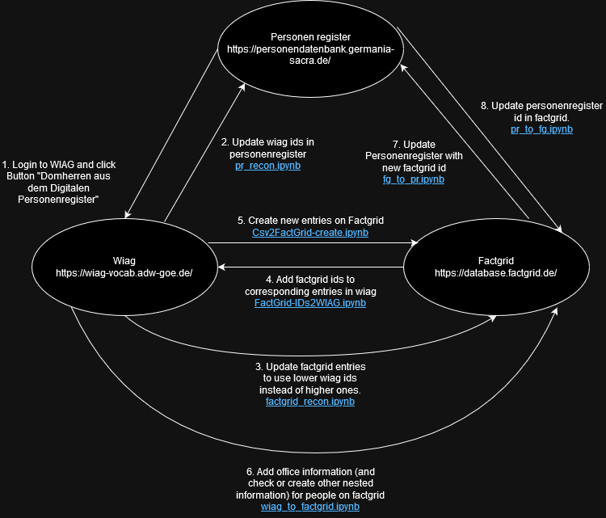

# Synchronizing Data Between PR, WIAG, and FactGrid Using Jupyter Notebooks

## Introduction

This document provides an overview of the process for synchronizing data between three databases:

- **Personenregister (PR)**: The primary source of data containing persons from books produced by Germania Sacra.
- **WIAG**: A local MySQL database with an API.
- **FactGrid (FG)**: A Wikidata-based site for historians.

This guide is intended for team members at Germania Sacra who are domain experts in historical texts but may not have technical expertise. It will help you understand and execute the Jupyter notebooks designed to synchronize data between these databases.

The list of all documents that are part of this documentation are:

1. [This Document](https://github.com/WIAG-ADW-GOE/WIAGweb2/blob/main/notebooks/sync_notebooks/Readme.md)
2. [Software Installation](https://github.com/WIAG-ADW-GOE/WIAGweb2/blob/main/notebooks/sync_notebooks/docs/Installation.md)
3. [Running SQL](https://github.com/WIAG-ADW-GOE/WIAGweb2/blob/main/notebooks/sync_notebooks/docs/Run_SQL_Query_and_Export_CSV.md)
4. [Running Factgrid](https://github.com/WIAG-ADW-GOE/WIAGweb2/blob/main/notebooks/sync_notebooks/docs/Run_factgrid_csv.md)
5. [Wiag export](https://github.com/WIAG-ADW-GOE/WIAGweb2/blob/main/notebooks/sync_notebooks/docs/wiag_export.md)

## Prerequisites

Before you begin, ensure you have the following:

### Software Requirements

- **Python**: Required to run the Jupyter notebooks.
- **Julia**: Some notebooks are written in Julia.
- **Jupyter Notebook**: An interactive environment for running the notebooks.

#### Required Libraries

A list of necessary Python and Julia libraries will be provided separately. Please ensure all required libraries are installed before proceeding.

### Access and Credentials

- **Database Access**: Credentials are needed to interact with PR, WIAG, and FG databases.
- **CSV Files**: Some notebooks require CSV files obtained by running SQL queries on the databases.

To obtain the necessary credentials and CSV files, please contact **Barbara Kroeger** at Germania Sacra.

## Workflow Overview

The synchronization process involves several steps, each performed using a specific Jupyter notebook or action. The steps are designed to be executed in a specific sequence to maintain data consistency.

### Sequence of Steps

1. **Import Personenregister Entries into WIAG** (Non-notebook action)
2. **Update WIAG IDs in Personenregister** (`pr_recon.ipynb`)
3. **Reconciling FactGrid Entries with WIAG IDs** (`factgrid_recon.ipynb`)
4. **Add FactGrid Links to WIAG** (`FactGrid-IDs2WIAG.ipynb`)
5. **Create New Entries on FactGrid from WIAG** (`Csv2FactGrid-create.ipynb`)
6. **Add Offices to Persons on FactGrid** (`wiag_to_factgrid.ipynb`)
7. **Update PR Entries with FactGrid Links** (`fg_to_pr.ipynb`)
8. **Update FactGrid Entries with PR Links** (`pr_to_fg.ipynb`)

Note:

- Steps 2 and 3 can be run in parallel, ie, the order of running these notebooks does not matter
- Step 6 can be skipped. This step is very long and you might not be interested in creating the offices for all persons along with all the other factgrid entries.

<!-- ## Input and Output Files Overview

Below is a summary of the input and output files required and generated by each step:

1. **Step 1**: No input files required; no output files generated.
2. **Step 2**:
   - **Input Files**:
     - CSV export from WIAG SQL database.
     - CSV export from PR SQL database.
   - **Output File**:
     - SQL file to be run on the PR SQL database.
3. **Step 3**:
   - **Input File**:
     - CSV file downloaded from the WIAG website.
   - **Output File**:
     - CSV file for FactGrid.
4. **Step 4**:
   - **Input File**:
     - CSV file downloaded from the WIAG website.
   - **Output File**:
     - SQL file for WIAG.
5. **Step 5**:
   - **Input Files**:
     - Two CSV files downloaded from the WIAG website.
   - **Output File**:
     - CSV file for FactGrid.
6. **Step 6**:
   - **Input Files**:
     - Two CSV files downloaded from the WIAG website.
   - **Output Files**:
     - Multiple CSV files for FactGrid.
7. **Step 7**:
   - **Input File**:
     - CSV export from the PR SQL database.
   - **Output File**:
     - SQL file for the PR SQL database.
8. **Step 8**:
   - **Input File**:
     - CSV export from the PR SQL database.
   - **Output File**:
     - CSV file for FactGrid.
   - **Note**: This notebook is not yet complete. -->

## Detailed Instructions

### Step 1: Import Personenregister Entries into WIAG

**Action**: Use the button in WIAG to automatically import persons from PR into WIAG.

- **Source**: PR
- **Destination**: WIAG

**Instructions**:

1. Log in to WIAG using your credentials.
2. Navigate to **Edit > Domherren aus dem Digitalen Personenregister**.
3. Scroll to the bottom of the page and click the **Start** button to import entries from PR.
4. Newly imported entries will receive a higher WIAG ID, distinguishing them from native WIAG entries.
5. These entries require manual review. After verification, they will be assigned a lower WIAG ID.

### Step 2: Update WIAG IDs in Personenregister

**Notebook**: `pr_recon.ipynb`

- **Source**: WIAG
- **Destination**: PR

**Purpose**: Updates PR with the WIAG IDs assigned to each person, ensuring PR remains the primary and up-to-date source of data.

**Input Files**:

- `item_<current_date>.csv`: Exported from the WIAG SQL database.
- `pr_<current_date>.csv`: Exported from the PR SQL database.

**Output File**:

- `update_personen_register_<current_date>.sql`: SQL file to be run on the PR SQL database.

**Instructions**:

1. Obtain the input CSV files:
   - Export `item_<current_date>.csv` from the WIAG SQL database.
   - Export `pr_<current_date>.csv` from the PR SQL database.
2. Place the CSV files in the appropriate directory as required by the notebook.
3. Open `pr_recon.ipynb` in Jupyter Notebook.
4. Run each cell sequentially by clicking `Run` or pressing `Shift + Enter`.
5. Some cells may prompt you for input or require you to check outputs. Pause and verify as needed.
6. Upon completion, the notebook will generate `update_personen_register_<current_date>.sql`.
7. Run `update_personen_register_<current_date>.sql` on the PR SQL database to update the WIAG IDs.

### Step 3: Reconciling FactGrid Entries with WIAG IDs

**Notebook**: `factgrid_recon.ipynb`

- **Source**: WIAG
- **Destination**: FG

**Purpose**: Identifies FG entries linked to higher WIAG IDs and updates them to the correct lower IDs after manual review.

**Input File**:

- `wiag_persons.csv`: Downloaded from the WIAG website.

**Output File**:

- `factgrid_updates.csv`: CSV file to be used for updating FactGrid.

**Instructions**:

1. Download `wiag_persons.csv` from the WIAG website.
2. Place the CSV file in the required directory.
3. Open `factgrid_recon.ipynb` in Jupyter Notebook.
4. Run each cell sequentially.
5. The notebook will identify discrepancies in WIAG IDs.
6. The output `factgrid_updates.csv` contains the necessary updates.
7. Upload `factgrid_updates.csv` to FactGrid or apply the updates manually as instructed.

### Step 4: Add FactGrid Links to WIAG

**Notebook**: `FactGrid-IDs2WIAG.ipynb`

- **Source**: FG
- **Destination**: WIAG

**Purpose**: Adds links to FG entries within the WIAG database.

**Input File**:

- `wiag_persons.csv`: Downloaded from the WIAG website.

**Output File**:

- `update_wiag.sql`: SQL file to be run on the WIAG database.

**Instructions**:

1. Download `wiag_persons.csv` from the WIAG website.
2. Place the CSV file in the appropriate directory.
3. Open `FactGrid-IDs2WIAG.ipynb`.
4. Run the notebook cell by cell.
5. Upon completion, `update_wiag.sql` will be generated.
6. Run `update_wiag.sql` on the WIAG database to add the FG links.

### Step 5: Create New Entries on FactGrid from WIAG

**Notebook**: `Csv2FactGrid-create.ipynb`

- **Source**: WIAG
- **Destination**: FG

**Purpose**: Creates new FG entries using data from WIAG.

**Input Files**:

- `wiag_new_persons.csv`: Downloaded from the WIAG website.
- `wiag_existing_persons.csv`: Downloaded from the WIAG website.

**Output File**:

- `factgrid_new_entries.csv`: CSV file for creating new entries on FactGrid.

**Instructions**:

1. Download the following CSV files from the WIAG website:
   - `wiag_new_persons.csv`
   - `wiag_existing_persons.csv`
2. Place the CSV files in the required directory.
3. Open `Csv2FactGrid-create.ipynb`.
4. Run each cell in order.
5. The notebook will generate `factgrid_new_entries.csv`.
6. Upload `factgrid_new_entries.csv` to FactGrid to create new entries.

### Step 6: Add Offices to Persons on FactGrid

**Notebook**: `wiag_to_factgrid.ipynb`

- **Source**: WIAG
- **Destination**: FG

**Purpose**: Adds office information to existing persons on FG. This is the most complex notebook and requires careful attention.

**Input Files**:

- `wiag_persons.csv`: Downloaded from the WIAG website.
- `wiag_offices.csv`: Downloaded from the WIAG website.

**Output Files**:

- Multiple CSV files for FactGrid, such as `factgrid_offices_part1.csv`, `factgrid_offices_part2.csv`, etc.

**Instructions**:

1. Download `wiag_persons.csv` and `wiag_offices.csv` from the WIAG website.
2. Place the CSV files in the appropriate directory.
3. Open `wiag_to_factgrid.ipynb`.
4. Proceed through the notebook one cell at a time.
5. Pay special attention to any instructions for manual supervision.
6. Check outputs carefully and make necessary adjustments in the databases if required.
7. The notebook will generate multiple CSV files for FactGrid.
8. Upload these CSV files to FactGrid to add office details to the corresponding persons.

### Step 7: Update PR Entries with FactGrid Links

**Notebook**: `fg_to_pr.ipynb`

- **Source**: FG
- **Destination**: PR

**Purpose**: Updates PR entries to include links to their corresponding FG entries.

**Input File**:

- `pr_persons.csv`: Exported from the PR SQL database.

**Output File**:

- `update_pr_factgrid.sql`: SQL file to be run on the PR SQL database.

**Instructions**:

1. Export `pr_persons.csv` from the PR SQL database.
2. Place the CSV file in the required directory.
3. Open `fg_to_pr.ipynb`.
4. Run each cell sequentially.
5. Upon completion, `update_pr_factgrid.sql` will be generated.
6. Run `update_pr_factgrid.sql` on the PR SQL database to add the FG links.

### Step 8: Update FactGrid Entries with PR Links

**Notebook**: `pr_to_fg.ipynb`

- **Source**: PR
- **Destination**: FG

**Purpose**: Ensures FG entries link back to the corresponding PR entries.

**Note**: This notebook is not yet complete.

**Input File**:

- `pr_persons.csv`: Exported from the PR SQL database.

**Output File**:

- `factgrid_pr_links.csv`: CSV file for FactGrid.

**Instructions**:

1. Export `pr_persons.csv` from the PR SQL database.
2. Place the CSV file in the required directory.
3. Open `pr_to_fg.ipynb`.
4. Run the notebook cell by cell.
5. Since the notebook is not yet complete, it may not generate the final output.
6. Once completed, the notebook will generate `factgrid_pr_links.csv`.
7. Upload `factgrid_pr_links.csv` to FactGrid to update entries with PR links.

## Best Practices

- **Sequential Execution**: Follow the steps in the specified order to maintain data integrity. Steps 2 and 3 may be run in parallel if needed.
- **Manual Supervision**: Some notebook cells require manual checks. Take the time to review outputs and make any necessary adjustments.
- **Running Cells**: Execute cells one at a time to monitor progress and catch any errors early.
- **Verification**: After running each notebook, check that the expected outputs are generated and that updates are reflected in the databases.
- **Data Consistency**: Ensure that any changes made are consistent across all databases to prevent discrepancies.

## Troubleshooting

- **CSV File Handling**: If a notebook requires a CSV file, ensure it is properly downloaded and renamed as instructed.
- **Common Issues**: While uncommon, you might encounter issues like missing libraries or incorrect file paths. Review error messages for guidance.
- **Assistance**: If you need help or encounter persistent issues, please contact **Barbara Kroeger** at Germania Sacra.

## Additional Resources

- **Library Installation Guide**: Refer to the provided documentation for installing necessary Python and Julia libraries.
- **Diagram of Data Flow**: A visual diagram illustrating the synchronization process is available upon request.

## Conclusion

By following this guide, you will effectively synchronize data between PR, WIAG, and FactGrid. This ensures that all platforms are up-to-date and that historical data remains consistent and accurate across the databases.
