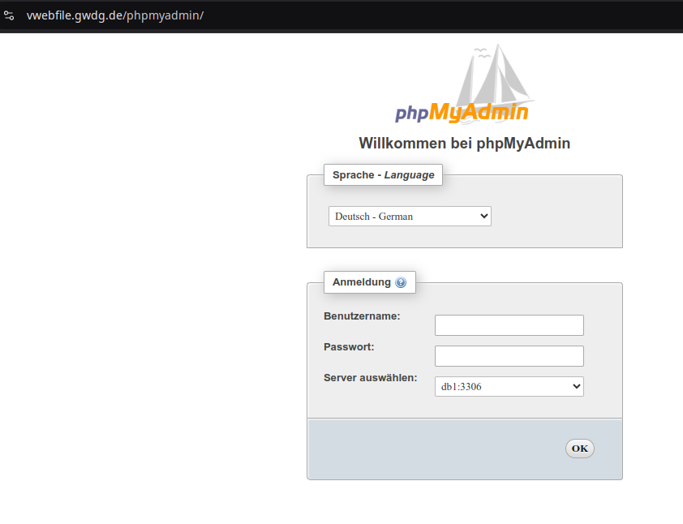
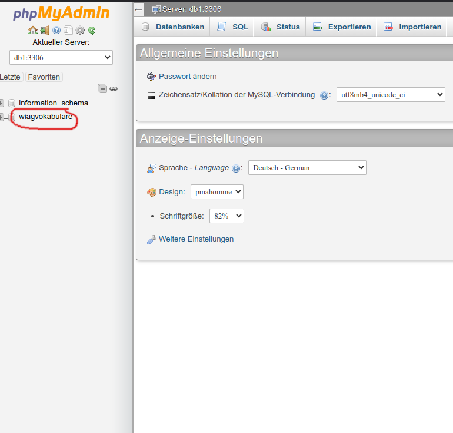
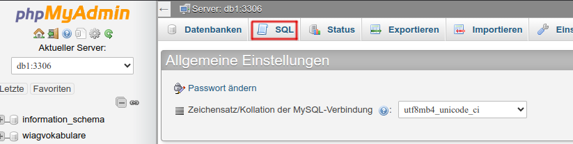
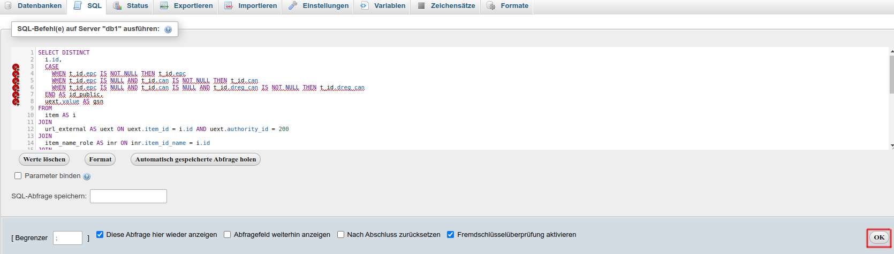
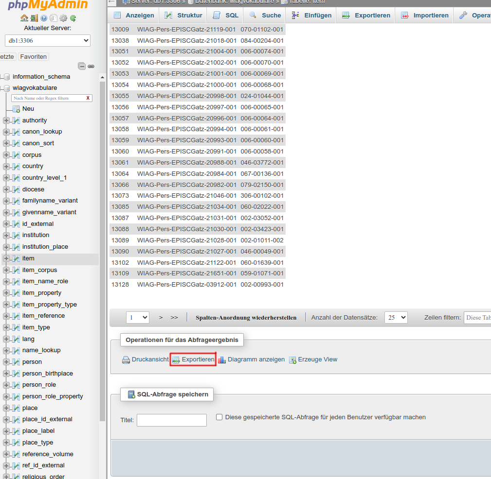
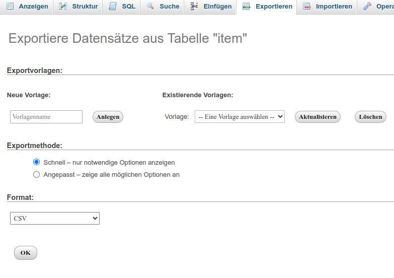
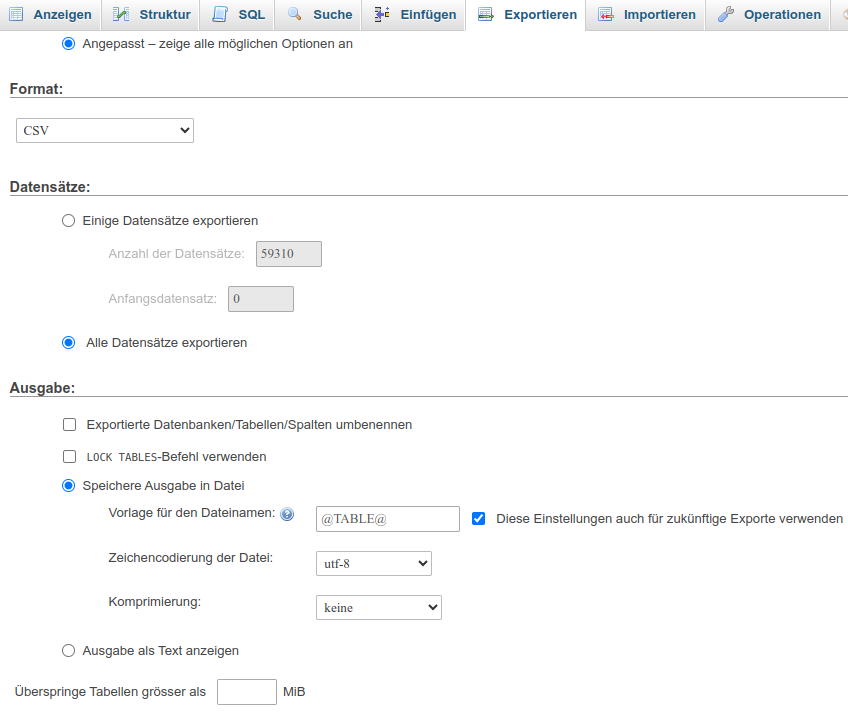
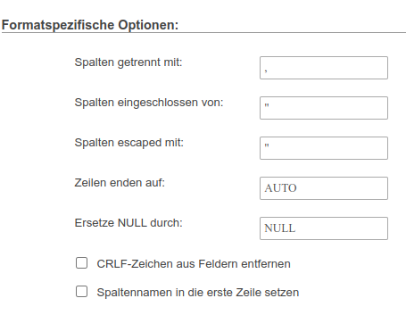

# Running SQL Queries and Exporting Results as CSV

This guide provides step-by-step instructions for non-technical users to run a SQL query on the **wiag** database using **phpMyAdmin**, export the results as a CSV file, and move the CSV file to a specific directory.

## Table of Contents

1. [Prerequisites](#prerequisites)
2. [Accessing phpMyAdmin](#accessing-phpmyadmin)
3. [Selecting the Database](#selecting-the-database)
4. [Running the SQL Query](#running-the-sql-query)
5. [Exporting the Results as CSV](#exporting-the-results-as-csv)
6. [Moving the CSV File](#moving-the-csv-file)
7. [Troubleshooting](#troubleshooting)
8. [Additional Notes](#additional-notes)

## Prerequisites

- **Credentials:** Obtain your phpMyAdmin login credentials from **Barbara Kroeger**.

_No additional software installations or prerequisites are required._


## Accessing phpMyAdmin

1. **Open Your Web Browser:**

   - Launch your preferred web browser (e.g., Chrome, Firefox, Edge).

2. **Navigate to phpMyAdmin:**

   - Enter the following URL in the address bar and press Enter:
     ```
     https://vwebfile.gwdg.de/phpmyadmin/
     ```

3. **Log In:**

   - **Username:** Enter your provided username.
   - **Password:** Enter your provided password.
   - Click the **"Ok"** button to log in.

   

   _If you encounter any login issues, please contact Barbara Kroeger._

---

## Selecting the Database

1. **Locate the Database List:**

   - On the left sidebar, you will see a list of databases.

2. **Select the **wiag** Database:**

   - Click on the **"wiagvokabulare"** database to select it. This could be something different as well. Usually there would be only two options, one of them being: `information_schema`, which is MySQL's internal database, which is not relevant to our use case.
     

## Running the SQL Query

1. **Navigate to the SQL Tab:**

   - After selecting the **wiag** database, click on the **"SQL"** tab located at the top of the page.

   

2. **Enter the SQL Query:**

   - In the SQL query editor, paste your SQL query provided in the accompanying document.

3. **Execute the Query:**

   - After pasting the query, click the **"OK"** button to run it.

   

   - **Note:** The example here is taken from the first query in `pr_recon.ipynb` The red lines on the words here can be ignored.


## Exporting the Results as CSV

1. **Scroll to the Export Section:**

   - After the query executes, scroll down the page until you find the **"Exportieren"** button (Export in German).

2. **Click on "Exportieren":**

   - Click the **"Exportieren"** button to proceed to the export options.

   

3. **Select Export Method:**

   - On the export page, ensure the **"Schnell - nur notwendigen Optionen anzeigen"** (Fast - display only the minimal necessary options) is selected. This option is usually selected by default.
   - In the **"Format"** dropdown menu, select **"CSV"**.

   

   - _Note_: in case you have exported in csv in a different format before or the csv is not in the right format, In the **"Format"** dropdown menu, select **"CSV"**.

   
   

   - Click the **"OK"** button to download the CSV file. This will now start downloading the file.


## Moving the CSV File

- Navigate to the folder where the CSV file was downloaded.
- Open **File Explorer** on your computer.

- Go to the following directory path where <notebook_path> is the location where you extracted the zip file (or clone the github repository):
  ```
  <notebook_path>/notebooks/sync_notebooks/input_files
  ```
- Move the CSV File by either dragging and dropping or copying and pasting.
- Rename the file if required.

## Troubleshooting

If you encounter any issues while following these steps, consider the following solutions:

### 1. Unable to Log In to phpMyAdmin

- **Check Credentials:**
  - Ensure you are using the correct username and password provided by Barbara Kroeger.
- **Forgot Password:**
  - If you've forgotten your password, contact Barbara Kroeger to reset it.

### 2. SQL Query Errors

- **Syntax Errors:**
  - Ensure the entire SQL query is copied correctly without any missing parts.
- **Permissions:**
  - If you receive a permission error, verify with Barbara Kroeger that your account has the necessary access rights.

### 3. Export Issues

- **Export Button Not Visible:**
  - Make sure you have successfully executed the SQL query before attempting to export.
- **File Not Downloading:**
  - Check your browser's download settings or try using a different browser.

### 4. Moving the CSV File

- **Target Directory Not Found:**
  - Verify the directory path provided in the instructions. If it's different, follow the specific path given.
- **File Not Moving:**
  - Ensure the CSV file is not open in another program.

## Additional Notes

- **Assistance:** If you need further help or encounter issues not covered in this guide, please reach out to **Barbara Kroeger** for support.


_This documentation was last updated on December 3, 2024._
