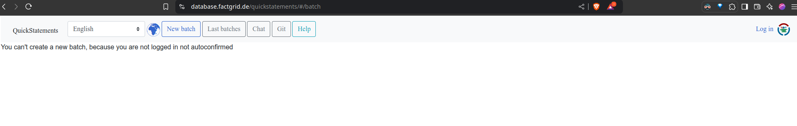
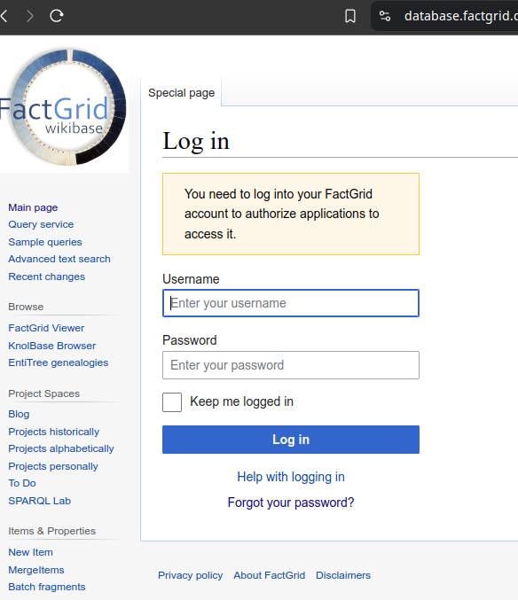
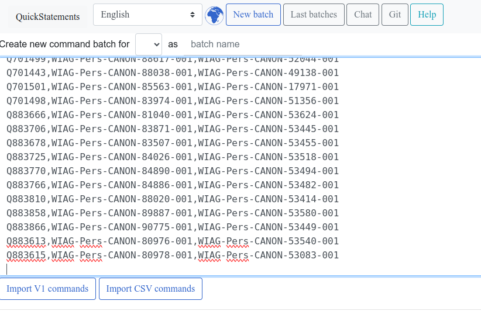
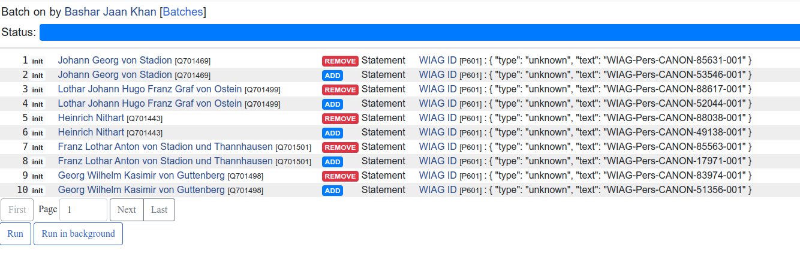

# Running SQL Queries and Exporting Results as CSV

This guide provides instructions for users to upload data to Factgrid using Quickstatments. This will be done by first logging in Factgrid, creating a batch, and then uploading the csv file for the batch.

## Table of Contents

1. [Prerequisites](#prerequisites)
2. [Accessing Factgrid](#accessing-factgrid)
3. [Selecting the Database](#selecting-the-database)
4. [Running the SQL Query](#running-the-sql-query)
5. [Exporting the Results as CSV](#exporting-the-results-as-csv)
6. [Moving the CSV File](#moving-the-csv-file)
7. [Troubleshooting](#troubleshooting)
8. [Additional Notes](#additional-notes)

## Prerequisites

- **Credentials:** Obtain your Factgrid login credentials from **Barbara Kroeger**.

_No additional software installations or prerequisites are required._

## Accessing Factgrid

1. **Open Your Web Browser:**

   - Launch your preferred web browser (e.g., Chrome, Firefox, Edge).

2. **Navigate to Factgrid:**

   - Enter the following URL in the address bar and press Enter:

     ```
     https://database.factgrid.de/quickstatements/#/batch
     ```

     You will be greeted with the following page.

     

3. **Log In:**

   - Click on the Log in the top right. This will take you to factgrid's login screen.

   

   - **Username:** Enter your provided username.
   - **Password:** Enter your provided password.
   - Click the **Log in** button to log in.
   - Click **Allow** on the next screen. This will bring you back to quickstatements.

   _If you encounter any login issues, please contact Barbara Kroeger._

---

## Creating new Batch

1. Click on "New Batch"

2. In the new screen click on the empty text box and paste the generated text from the csv file

3. Click on "Import CSV Commands"
   

## Running the Query

1. Clicking on the "Import CSV Commands" should show the list of changes on a new screen.
2. You can check the correctness of these changes by clicking the links and confirming the changes.
3. Execute the query by cliking on Run.
   

## Error handling

Running the query can sometimes lead to errors. This fix cannot be done automatically and must be done manually.

## Additional Notes

- **Assistance:** If you need further help or encounter issues not covered in this guide, please reach out to **Barbara Kroeger** for support.

_This documentation was last updated on December 9, 2024._
